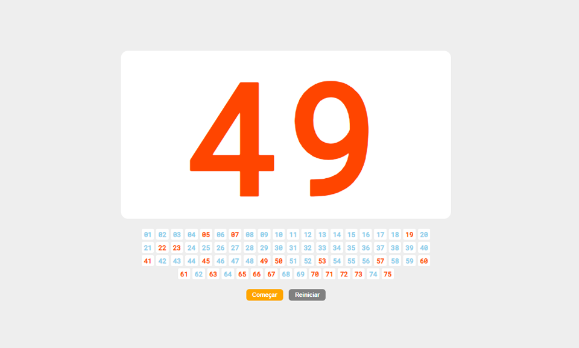

<div align="center">

# Bingo Fest! 🎱

</div>

Sorteador de números de bingo, simples, leve e sem necessidade de instalação — basta abrir o `index.html` no navegador ou publicar como site estático.



## ✨ Funcionalidades

- Sorteio aleatório de números (padrão: 1 a 75)
- Histórico visual dos números já sorteados
- Efeitos sonoros de tambor durante o sorteio e prato ao parar
- Progresso salvo automaticamente (`localStorage`) — recarregar a página não perde o jogo
- Atalho de teclado: **Espaço** inicia/para o sorteio
- Botão de reinício com confirmação

## 🚀 Como usar

1. Clone o repositório:
   ```bash
   git clone https://github.com/<seu-usuario>/bingo-fest.git
   cd bingofest
   ```
2. Abra o `index.html` diretamente no navegador, ou sirva a pasta com qualquer servidor estático, por exemplo:
   ```bash
   npx serve .
   ```

Não há passo de build — é HTML/CSS/JS puro com módulos ES.

## ⚙️ Personalização

É possível alterar a quantidade máxima de números via query string:

```
index.html?max=90
```

O valor deve ser um inteiro entre 1 e 999 (fora desse intervalo, o padrão de 75 é usado).

## 🗂️ Estrutura do projeto

```
bingo-fest/
├── assets/         # imagens, sons e bibliotecas vendorizadas (Vue, Lodash)
├── css/            # estilos
├── js/
│   ├── app.js               # inicialização da aplicação e leitura de parâmetros
│   ├── index.js              # ponto de entrada
│   ├── pingo.js               # componente Vue principal (sorteio)
│   ├── repository.js          # persistência em localStorage
│   └── sound-controller.js    # controle dos efeitos sonoros
└── index.html
```

## 🛠️ Tecnologias

- [Vue 2](https://vuejs.org/) (via módulo ES, sem build)
- [Lodash](https://lodash.com/) (utilitários)
- HTML5 / CSS3 puro

## 👤 Autor

**Marcus Guarani**

[](https://github.com/marcusguarani)
[](https://www.linkedin.com/in/marcusguarani)
[](https://marcusguarani.com.br)


## 📄 Licença

Código distribuído sob a licença MIT. Veja [LICENSE](LICENSE) para mais detalhes (os efeitos sonoros têm licenciamento próprio, separado do código).
